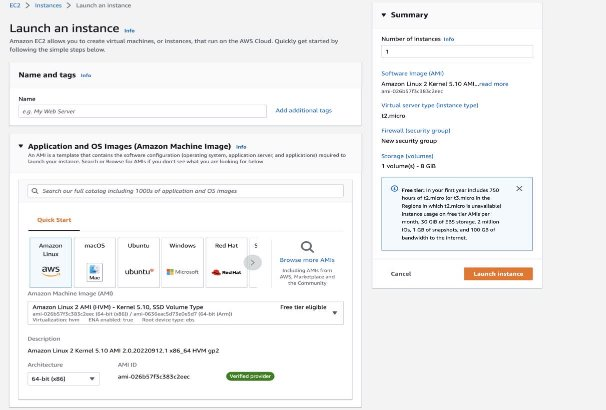

Boto3 tutorial exercises 

**Boto3 Tutorial Exercises** 

In this tutorial, we’ll take a look at using Python scripts to interact with infrastructure provided by Amazon Web Services (AWS). This tutorial is based on a boto3 tutorial provided by the Linux Academy.  

In previous exercises you learned to configure a workstation with Python and the Boto3 library and also how to setup API access to an AWS user account for your python exercises. Now, you’ll learn how to programmatically create and manipulate: 

- Virtual machines in Elastic Compute Cloud (EC2) 
- Buckets and files in Simple Storage Service (S3) 

Before we get started, there are a few things that you’ll need to put in place: 

- Make sure you have completed the installation and set-up of Python 3 and boto3 as described in previous exercise sheets. 
- Access to a Linux shell environment with an active internet connection. 

**Note:** All of the Python code is available to download from Moodle – this should overcome any formatting errors you would encounter if you were trying to copy and paste the code from this document.   

**Scripting EC2** 

The Elastic Compute Cloud (EC2) is a service for managing virtual machines running in AWS. Let’s see how we can use Python3 and the boto3 library with EC2. 

***List Instances*** 

For our first script, let’s list the instances we have running in EC2. We can get this information with just a few short lines of code. First, we’ll import the boto3 library. Using the library, we’ll create an EC2 resource. This is like a handle to the EC2 console that we can use in our script. Finally, we’ll use the EC2 resource to get all of the instances and then print their instance ID and state. Here’s what the script looks like: 

**#!/usr/bin/env python3** 

**import boto3** 

**ec2 = boto3.resource('ec2')** 

**for instance in ec2.instances.all():** 

`    `**print (instance.id, instance.state)** 

Download this file from Moodle and save as list\_instances.py and change the mode to executable. That will allow you to run the script directly from the command line – remember you use **chmod +x** on the remaining scripts to get them running. Of course, you can edit these files if you want to try out different boto3 features. 

$ nano list\_instances.py                                       *# you may wish to use another editor such as gedit instead of nano* $ chmod +x list\_instances.py 

$ ./list\_instances.py 

If you haven’t created any instances, running this script won’t produce any output. So let’s fix that by moving on to the next step and creating some instances. ![ref1]

***Create an Instance*** 

One of the key pieces of information we need for scripting EC2 is an Amazon Machine Image (AMI) ID. This will let us tell our script what type of EC2 instance to create. While getting an AMI ID can be done programmatically, that's an advanced topic beyond the scope of this tutorial. For now, let’s go back to the AWS console and get an ID from there. 

In the AWS console, go the EC2 service and click the “Launch Instance” button. On the next screen, you’re presented with the following screen :

Make a note of the AMI ID. In this example, its “**ami-026b57f3c383c2eec**" That’s the value we need for our script. Note that AMI IDs differ across regions and are updated often so the latest ID for the Amazon Linux AMI may be different for you. 

Now with the AMI ID, we can complete our script. Following the pattern from the previous script, we’ll import the boto3 library and use it to create an EC2 resource. Then we’ll call the create\_instances() function, passing in the image ID, max and min counts, and the instance type. We can capture the output of the function call, which is an instance object. For reference, we can print the instance’s ID. 

**#!/usr/bin/env python3** 

**import boto3** 

**ec2 = boto3.resource('ec2')** 

**instance = ec2.create\_instances(** 

`    `**ImageId= 'ami-026b57f3c383c2eec',**     **MinCount=1,** 

`    `**MaxCount=1,** 

`    `**InstanceType='t2.nano')** 

**print (instance[0].id)** 

While the command will finish quickly, it will take some time for the instance to be created. Run the *list\_instances.py* script several times to see the state of the instance change from pending to running. ![ref1]

***Terminate an Instance*** 

Now that we can programmatically create and list instances, we also need a method to terminate them. 

For this script, we’ll follow the same pattern as before with importing the boto3 library and creating an EC2 resource. But we’ll also take one parameter: the ID of the instance to be terminated. To keep things simple, we’ll consider any argument to the script to be an instance ID. We’ll use that ID to get a connection to the instance from the EC2 resource and then call the terminate() function on that instance. Finally, we print the response from the terminate function. Here’s what the script looks like: 

**#!/usr/bin/env python3** 

**import sys** 

**import boto3** 

**ec2 = boto3.resource('ec2')** 

**for instance\_id in sys.argv[1:]:** 

`    `**instance = ec2.Instance(instance\_id)**     **response = instance.terminate()** 

`    `**print (response)** 

Run the *list\_instances.py* script to see what instances are available. Note one of the instance IDs to use as input to the *terminate\_instances.py* script. After running the terminate script, we can run the list instances script to confirm the selected instance was terminated. That process looks something like this: 

**$ ./list\_instances.py** 

i-02951a58739124962 {'Name': 'running', 'Code': 16} 

**$ ./terminate\_instances.py i-0c34e5ec790618146** 

{'ResponseMetadata': {'HTTPStatusCode': 200, 'HTTPHeaders': {'x-amzn-requestid': 'ac7a5a40-ec72-4def-98a1-edb26cd579bf', 'vary': 'accept-encoding', 'content- type': 'text/xml;charset=UTF-8', 'transfer-encoding': 'chunked', 'date': 'Wed, 21 Oct 2020 09:26:39 GMT', 'server': 'AmazonEC2'}, 'RetryAttempts': 0, 'RequestId': 'ac7a5a40-ec72-4def-98a1-edb26cd579bf'}, 'TerminatingInstances': [{'PreviousState': {'Name': 'running', 'Code': 16}, 'InstanceId': 'i- 02951a58739124962', 'CurrentState': {'Name': 'shutting-down', 'Code': 32}}]} 

**$ ./list\_instances.py** 

i-02951a58739124962 {'Code': 48, 'Name': 'terminated'} ![ref1]

**Scripting S3** 

The AWS Simple Storage Service (S3) provides object storage similar to a file system. Folders are represented as buckets and the contents of the buckets are known as keys. Of course, all of these objects can be managed with Python and the boto3 library. 

***List Buckets and Their Contents*** 

Our first S3 script will let us see what buckets currently exist in our account and any keys inside those buckets. 

Of course, we’ll import the boto3 library. Then we can create an S3 resource. Remember, this gives us a handle to all of the functions provided by the S3 console. We can then use the resource to iterate over all buckets. For each bucket, we print the name of the bucket and then iterate over all the objects inside that bucket. For each object, we print the object’s key or essentially the object’s name. The code looks like this: 

**#!/usr/bin/env python3** 

**import boto3** 

**s3 = boto3.resource('s3')** 

**for bucket in s3.buckets.all():** 

`    `**print (bucket.name)** 

`    `**print ("---")** 

`    `**for item in bucket.objects.all():         print ("\t%s" % item.key)** 

If you don’t have any buckets when you run this script, you won’t see any output. Let’s create a bucket or two and then upload some files into them. 

***Create a Bucket*** 

In our bucket creation script, let's import the boto3 library (and the sys library too for command line arguments) and create an S3 resource. We’ll consider each command line argument as a bucket name and then, for each argument, create a bucket with that name. 

We can make our scripts a bit more robust by using Python’s *try* and *except* features. If we wrap our call to the *create\_bucket()* function in a *try:* block, we can catch any errors that might occur. If our bucket creation goes well, we simply print the response. If an error is encountered, we can print the error message and exit gracefully. Here’s what that script looks like: 

**#!/usr/bin/env python3** 

**import sys** 

**import boto3** 

**s3 = boto3.resource("s3")** 

**for bucket\_name in sys.argv[1:]:** 

`    `**try:** 

`      `**response = s3.create\_bucket(Bucket=bucket\_name)          print (response)** 

`     `**except Exception as error:** 

`         `**print (error)** 

Creating a bucket is easy but comes with some rules and restrictions. To get the complete run-down, read the[ Bucket Restrictions and Limitations ](http://docs.aws.amazon.com/AmazonS3/latest/dev/BucketRestrictions.html)section in the S3 documentation. The two rules that needs to be emphasized for this example are 1) bucket names must be globally unique and 2) bucket names must follow DNS naming conventions. Note that you need to specify a LocationConstraint in the create\_bucket method if the S3 bucket is to be created in a region other than the default us-east-1. ![ref1] When choosing a bucket name, pick one that you are sure hasn’t been used before and only use lowercase letters, numbers, and hyphens. 

Because simple bucket names like “my\_bucket” are usually not available, a good way to get a unique bucket name is to use a name, a number, and the date. For example: 

**$ ./create\_bucket.py projectx-bucket1-$(date +**'**%F**'**-**'**%s**'**)** s3.Bucket(name='projectx-bucket1-2020-10-14-1483305884') 

Now we can run the list\_buckets.py script again to see the buckets we created. 

**$ ./list\_buckets.py** projectx-bucket1-2020-10-14-1483305884 

Our buckets are created but they’re empty. Let’s put some files into these buckets. ***Put a File into a Bucket*** 

Similar to our bucket creation script, we start the put script by importing the sys and boto3 libraries and then creating an S3 resource. Now we need to capture the name of the bucket we’re putting the file into and the name of the file as well. We’ll consider the first argument to be the bucket name and the second argument to be the file name. 

To keep with robust scripting, we’ll wrap the call to the put() function in a try; block and print the response if all goes well. If anything fails, we’ll print the error message. That script comes together like this: 

**#!/usr/bin/env python3** 

**import sys** 

**import boto3** 

**s3 = boto3.resource("s3")** 

**bucket\_name = sys.argv[1]** 

**object\_name = sys.argv[2]** 

**try:** 

`    `**response = s3.Object(bucket\_name, object\_name).put(Body=open(object\_name, 'rb'))     print (response)** 

**except Exception as error:** 

`    `**print (error)** 

For testing, we can create some empty files and then use the *put\_bucket.py* script to upload each file into our target bucket. 

**$ touch file{1,2,3,4}.txt** 

**$ ./put\_bucket.py projectx-bucket1-2020-10-14-1483305884** **file1.txt** {'ResponseMetadata': {'RetryAttempts': 0, 'HostId': 'GRXcmgc2dfN8jWrrkgFhC3kK7RydKOleHJoQgK+OaHxzq/f9uK5qDG1k/oc/Pgn6SZ12bI44a8U=', 'HTTPHeaders': {'x-amz-request-id': 'CBEDE939D1BF9681', 'date': 'Wed, 14 Oct 2020 09:32:11 GMT', 'x-amz-id-2': 'GRXcmgc2dfN8jWrrkgFhC3kK7RydKOleHJoQgK+OaHxzq/f9uK5qDG1k/oc/Pgn6SZ12bI44a8U=', 'etag': '"d41d8cd98f00b204e9800998ecf8427e"', 'server': 'AmazonS3', 'content- length': '0'}, 'HTTPStatusCode': 200, 'RequestId': 'CBEDE939D1BF9681'}, 'ETag': '"d41d8cd98f00b204e9800998ecf8427e"'} 

**$ ./put\_bucket.py projectx-bucket1-2020-10-14-1483305884** **file2.txt** ... 

**$ ./put\_bucket.py projectx-bucket1-2020-10-14-1483305884** **file3.txt** ... 

**$ ./put\_bucket.py projectx-bucket1-2020-10-14-1483305884** **file4.txt** ... ![ref1]

**$ ./list\_buckets.py** projectx-bucket1-2020-10-14-1483305884  --- 

`        `file1.txt 

`        `file2.txt 

`        `file3.txt 

`        `file4.txt 

Success! We’ve created a bucket and uploaded some files into it. Now let’s go in the opposite direction, deleting objects and then finally, deleting the bucket. 

***Delete Bucket Contents*** 

For our delete script, we’ll start the same as our create script: importing the needed libraries, creating an S3 resource, and taking bucket names as arguments. 

To keep things simple, we’ll delete all the objects in each bucket passed in as an argument. We’ll wrap the call to the delete() function in a try: block to make sure we catch any errors. Our script looks like this: 

**#!/usr/bin/env python3** 

**import sys** 

**import boto3** 

**s3 = boto3.resource('s3')** 

**for bucket\_name in sys.argv[1:]:** 

`    `**bucket = s3.Bucket(bucket\_name)     for key in bucket.objects.all():         try:** 

`            `**response = key.delete()             print (response)** 

`        `**except Exception as error:             print (error)** 

If we save this as ***./delete\_contents.py*** and run the script on our example bucket, output should look like this: 

**$ ./delete\_contents.py projectx-bucket1-2020-10-14-1483305884** {'ResponseMetadata': {'RetryAttempts': 0, 'HostId': 'vDMU+IO+2pqbERFvTmmHKLXYsvtkeSQjxHSS0x31xFQD3LIV9bd/4aALkQ/OzbmztvYh28+h2P0=', 'HTTPStatusCode': 204, 'RequestId': '0521B942D083D3B3', 'HTTPHeaders': {'x-amz-id- 2': 'vDMU+IO+2pqbERFvTmmHKLXYsvtkeSQjxHSS0x31xFQD3LIV9bd/4aALkQ/OzbmztvYh28+h2P0=', 'date': 'Wed, 14 Oct 2020 09:35:29 GMT', 'x-amz-request-id': '0521B942D083D3B3', 'server': 'AmazonS3'}}} 

... 

Now if we run the *list\_buckets.py* script again, we’ll see that our bucket is indeed empty. 

**$ ./list\_buckets.py** projectx-bucket1-2020-10-14-1483305884 --- 

***Delete a Bucket*** 

Our delete bucket script looks a lot like our delete object script. The same libraries are imported and the arguments are taken to be bucket names. We use the S3 resource to attach to a bucket with the specific name and then in our try: block, we call the delete() function on that bucket, catching the response. If the delete worked, we print the response. If not, we print the error message. Here’s the script: ![ref1]

**#!/usr/bin/env python3** 

**import sys** 

**import boto3** 

**s3 = boto3.resource('s3')** 

**for bucket\_name in sys.argv[1:]:** 

`    `**bucket = s3.Bucket(bucket\_name)     try:** 

`        `**response = bucket.delete()         print (response)** 

`    `**except Exception as error:** 

`        `**print (error)** 

One important thing to note when attempting to delete a bucket is that the bucket must be empty first. If there are still objects in a bucket when you try to delete it, an error will be reported and the bucket will not be deleted. 

Running our *delete\_buckets.py* script on our target bucket produces the following output: 

**$ ./delete\_buckets.py projectx-bucket1-2020-10-14-1483305884** {'ResponseMetadata': {'RetryAttempts': 0, 'HTTPHeaders': {'date': 'Wed, 14 Oct 2020 09:36:44 GMT', 'x-amz-id-2': 'ZzEL7KK6XhOPhACWjhJenk9S9ZmVHOqYEw6njkgfhI0cW6UfE5YydrqokP/YAiVEnOO2unmPbvY=', 'server': 'AmazonS3', 'x-amz-request-id': '56709F0FA46042B0'}, 'HostId': 'ZzEL7KK6XhOPhACWjhJenk9S9ZmVHOqYEw6njkgfhI0cW6UfE5YydrqokP/YAiVEnOO2unmPbvY=', 'RequestId': '56709F0FA46042B0', 'HTTPStatusCode': 204}} 

We can run *list\_buckets.py* again to see that our bucket has indeed been deleted. ![ref1]

[ref1]: Aspose.Words.43f1430c-399e-414e-b4b0-cc23474a1c6f.002.png
